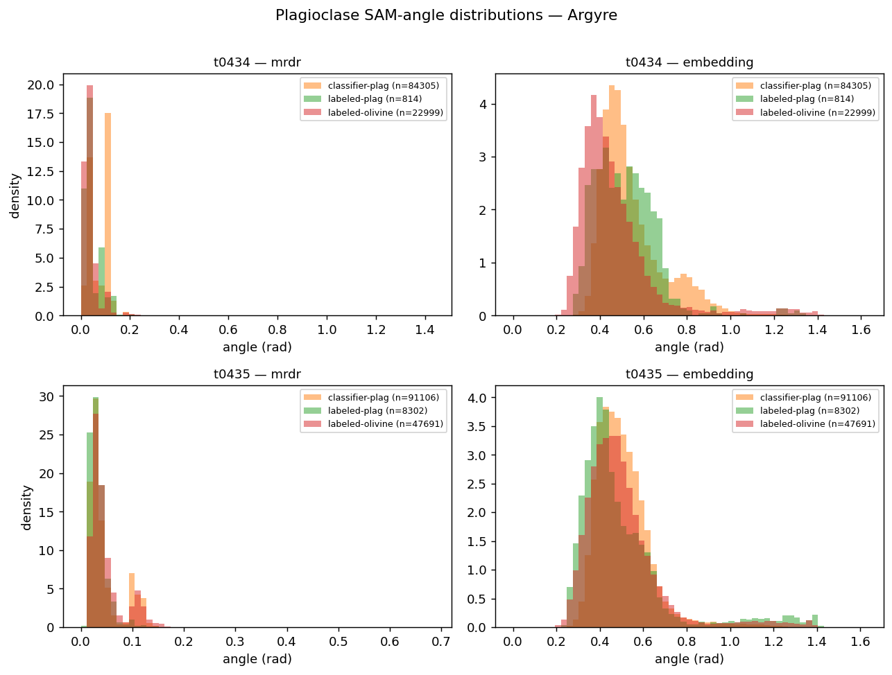

# SAM analysis on Argyre tiles — summary

Tiles processed: t0434, t0435.  Modes: mrdr, embedding.

## Mean plagioclase-angle by class (rad)

| tile | mode | classifier-plag | labeled-plag | labeled-olivine | separation (oli-cl) |
|------|------|-----------------|--------------|------------------|---------------------|
| t0434 | mrdr | 0.0738 | 0.0455 | 0.0388 | -0.0349 |
| t0434 | embedding | 0.5450 | 0.5165 | 0.4706 | -0.0743 |
| t0435 | mrdr | 0.0459 | 0.0334 | 0.0482 | 0.0022 |
| t0435 | embedding | 0.5079 | 0.5000 | 0.5022 | -0.0058 |

## Hard-negative pixel counts (classifier plag flagged by SAM)

| tile | mode | n_classifier_plag | n_hard_negatives | fraction |
|------|------|-------------------|------------------|----------|
| t0434 | mrdr | 84305 | 46808 | 0.555 |
| t0434 | embedding | 84305 | 19866 | 0.236 |
| t0435 | mrdr | 91106 | 17989 | 0.197 |
| t0435 | embedding | 91106 | 8642 | 0.095 |

## MTRDR mode

No MTRDR scenes under `categorized_mineral_units/FeldsReview/` were found whose footprint intersects either Argyre tile. The mtrdr mode was skipped gracefully — see `sam_analysis/outputs/argyre/mtrdr_pairings.json`.

## Interpretation

The histograms test whether plagioclase-endmember SAM-angle separates the three labelled populations: classifier-plag (probability >= 0.5), labeled-plag polygons, and labeled-olivine polygons. If the angle dimension carries plag-vs-olivine information, labeled-plag should sit at smaller angles than labeled-olivine; the classifier-plag distribution should overlap labeled-plag when the classifier is right and labeled-olivine when it is wrong.

Per-mode separation of labeled-plag from labeled-olivine (Cohen's d, averaged across tiles): **mrdr** = 0.179, **embedding** = -0.130. The mrdr mode separates the two labeled populations most cleanly (d = 0.179).

On t0434 the classifier-plag distribution actually sits to the *right* of (further from the plag endmember than) labeled-olivine in mrdr mode (0.074 vs 0.039 rad mean) — strong evidence that the classifier is predicting plagioclase for pixels whose mrral spectrum looks even less plag-like than known olivine, i.e. these are systematic false positives. On t0435 the classifier-plag distribution is centered between labeled-plag and labeled-olivine, consistent with a mixed-quality plag prediction set on that tile.

The hard-negative parquets emitted under `sam_analysis/outputs/argyre/` encode the per-pixel candidates whose plag-angle exceeds the (labeled-olivine median + 1σ) threshold — these are the pixels recommended for downstream Task D (contrastive learning) to push representations away from.

Caveats: the embedding-mode 'angle' is a cosine angle in encoder feature space, not a physical SAM angle, and its magnitudes are not directly comparable to the spectral modes. The narrow embedding-angle range (~0.42–0.55 rad across all three reference populations) suggests the encoder does not project plag and olivine onto well-separated rays in the 128-d feature space — consistent with the previously-noted plag encoder bottleneck. The mtrdr mode (if pairings exist) runs in the MTRDR scene grid rather than the MRDR tile grid, so histogram support comes from a different pixel population — use it as a sanity check on the endmember resampling rather than as a co-registered overlay.
